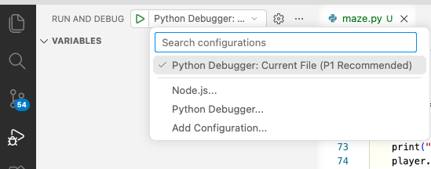
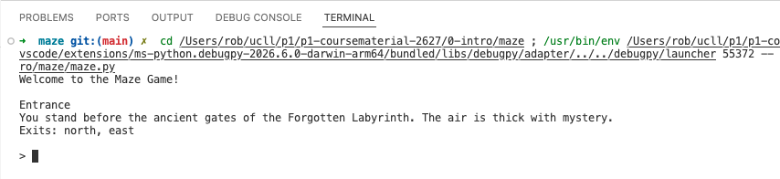

# What is programming?


## Writing instructions
Programming is really just writing instructions for your computer.

We write instructions for people all the time (well maybe not all the time, but at least sometimes). As an example, the
file before this one contained instructions to set up your computer for this course.

Programming is basically writing instructions like this, but to get your computer to do something.

This set of instructions we write for our computers can be called by many names, which we will use interchangeably:
  - code
  - script
  - program
  - software

Everything that you can do on your computer is written as software:
  - the games you play
  - the websites you visit
  - the apps you use

And much more software exists that you've probably never come into contact with yet. Applications that
  - manage all the information within a company
  - optimize routes that a delivery service uses to travel as little distance as possible
  - continuously visit all the websites in the world to gather their information
  - control traffic lights, telling them when to be green, red or yellow
  - steer robots, self-driving cars or rockets
  - ...

Nearly everything in our world runs on software.

Programming is creating this software, writing the instructions for the computer to follow, such that it can do all of
these things.

### Ambiguity

When people give instructions, they are rarely fully complete. For example, if your partner asks you "Hey, can you go to
the store to get me some yoghurt?", they are leaving out some instructions:
- Which yoghurt to buy?
- How much of it to buy?
- Which store to go to?
- How to get to the store?

You may think that the ambiguity in the previous instructions is merely due to not being specific enough ("If they cared
about which brand of yoghurt, they should have just specified the brand!").

That is partially true, but the natural languages (such as English) that we use in our daily lives are inherently ambiguous.
Consider the following examples:
- Look for the man with the binoculars — Should you use the binoculars or look for the man that has them?
- He fed her cat food! — Did he feed her cat, or did he make her eat cat food?
- We'll have dinner when the chicken is ready to eat — Will we eat chicken, or are we waiting because the chicken isn't hungry yet?

Of course, it's possible to try to be extra precise when writing your instructions, to try to avoid these kinds of tricky expressions that could be interpreted in multiple ways. However, they can easily slip in without you even noticing. When we write instructions, the meaning we intend is obvious to us, while other interpretations often aren't.

If you're still convinced you can write precise instructions in natural language well enough that they only have one possible interpretation, ask your lawyer friends how that is working out for them.

### Filling in the gaps

So why is ambiguity not really that big of a deal in your day-to-day life?

It's because, when people (or AI) follow instructions, they are often able to fill in these gaps.

If we look back at the yoghurt example:
- Being their partner, you probably know their favorite yoghurt.
- You probably also know what is an appropriate amount of yoghurt to buy for your household.
- You go to the store you always go to, or maybe it doesn't really matter which store you go to.
- You know the way or use maps to find it.

And for the language examples:
- If you're being handed binoculars, that's probably what they are talking about.
- If said with a regular tone of voice, they probably don't mean that one person made the other person eat cat food.

Additionally, if people realize the instructions they receive are ambiguous, they can simply ask what was meant by them.

This is usually great! This way we don't have to spell out all these little details in our instructions or have to be super pedantic about our language use. However, it also means that sometimes these gaps could be filled in wrong. In the case of the yoghurt example you could:
- not realize there are multiple kinds of yoghurt and just get the first one you see.
- think you know which yoghurt your partner usually likes and get that one. But it turns out they went sugar-free 2 weeks ago and you didn't notice.
- mess up in any of a million other ways.

With AI you might have encountered this as well: you ask it to write your essay, but it writes an essay that is too long, too short, or just so good that it will be completely obvious to the teacher that you didn't write it yourself.

### When the stakes rise

How much ambiguity we are okay with in our instructions depends on:
- how big the consequences are if a mistake is made
- whether the person following our instructions can ask for help while they are carrying out the instructions

Going back to the previous examples, the consequences are not that high, because even if it goes wrong, we are only mildly inconvenienced before we can correct the mistake for the next time:
- you tell your partner to bring the right yoghurt next time
- if you don't get the essay you want on the first try, you simply ask again, maybe slightly adjusting the wording of your prompt

However, as the stakes rise, we will often spend more time making sure our instructions are clear to everyone involved.

As an example, the installation instructions to set up your computer in this course will be followed by hundreds of students each year.
If there are ambiguities in this explanation, this will result in many more questions the teachers of this course need to answer,
costing them a lot of time (which they could have avoided by spending a little more time writing out the installation instructions).

Or imagine having to write down the instructions for the grocery shopping that will be done for the rest of your life, with no way of adjusting or clarifying once these instructions are sent out. You wouldn't want an ambiguity to cause you accidentally having to eat your least-favorite yoghurt until the end of time.

This is all to say, we generally **want less ambiguity in our instructions when the consequences of mistakes due to misinterpretation are higher**.

### Executed elsewhere, often, unsupervised

One of the key characteristics that differentiate software from the kind of instructions we give to other people or
even the chats we can have with an AI such as ChatGPT, is that software programs are instructions that will:
- be executed **many times** (often millions of times)
- run on **many different computers** in many places
- have to function **without the person that wrote the program being there to help**.

This means that the consequences of a potential ambiguity in such a program are much more severe.

Imagine you have to use a program to calculate your taxes. If the instructions were written ambiguously, it could result
in a wrong tax calculation for the millions of users who use this program. And the software can't just call the programmer
that wrote it to ask for clarification.

That's why, when we program computers, we don't want there to be room for any interpretation. We want the instructions to be unambiguous,
to only have one possible interpretation so that no mistakes can be made due to ambiguous instructions.

### Programming languages

So what do we do when we want to avoid ambiguity at all costs in software, but natural language makes us prone to writing ambiguous instructions?

We simply don't write software in natural language.

Instead we will use a different type of language, a **programming language**. Programming languages were specifically designed to have only one possible interpretation, and therefore avoid all ambiguity. The computers that run programs written in these languages were made to follow these instructions exactly, not to do any kind of interpretation (which is not needed because the instructions have only one possible interpretation), not to fill in any gaps or to question whether the instructions are really the best way to achieve the programmer's intended goal (which the computer doesn't know anything about, it can only read the instructions that were written).

This puts the burden of writing correct and complete instructions on us. Learning to do that may be a little hard initially, because we are not used to giving instructions this way.

Writing programs can take a lot of time. But once a program is written, it can be executed an infinite number of times, exactly the way you wrote it.


### Python

There are many programming languages. The [Wikipedia page that lists the 'notable' programming languages](https://en.wikipedia.org/wiki/List_of_programming_languages) has (at the time of writing) 673 entries! This might sound intimidating, but just like with natural languages (there are over 7000 of those!), you only need to know a couple of them to get around. Furthermore, a lot of programming languages are very similar, so once you've learnt your first one, learning a second or third is far easier (like learning Italian when you already know Spanish).

In this course we will learn Python. Python is a great first language to learn because
- it is very intuitive to use (which helps a lot when you start to learn, but will matter less as you get better at programming)
- it is a very popular language, which makes learning it easier as you can find a lot of resources and help for it online
- it is a very versatile language, meaning it can be used for many different purposes
- it is very good for prototyping and starting small projects

## Running programs

Before we start writing our own programs, let's first take a look at how we can run an existing one.

Open the file [maze.py](maze/maze.py) (you can simply click the link).

You don't need to understand its contents as they of course won't make any sense to you at this point (much like reading a language that you
haven't learned yet). It might be hard to believe, but what now looks like gibberish will make perfect sense at the end of the semester!

So let's run it and see what it does. To run the Python program that you are looking at in VS Code, select the `Run and Debug` () menu on the left.

In the dropdown menu, make sure to select `Python Debugger: Current File (P1 Recommended)` (if it isn't already):



Then, simply click the green `play`-button.

Doing this should have started the program. You should see a 'terminal' window appear at the bottom of your screen:



### A maze game

This file contains a maze game. It is what we call a text-based game:
- you receive instructions by text on the screen
- you play the game by typing text commands, in this case there are 3 of them:
    - `look`: tells you which room you're in and where you can go next
    - `go direction` (for example `go north`): moves you to the room in the specified direction. There are 4 directions: `north`, `east`, `south` and `west`.
    - `quit`: quits the game

The goal is to find the exit and escape the maze!

Some example gameplay:
```
Welcome to the Maze Game!

Entrance
You stand before the ancient gates of the Forgotten Labyrinth. The air is thick with mystery.
Exits: north, east

> go north
You move north to Hallway of Echoes

> look

Hallway of Echoes
A long corridor where every footstep reverberates like whispers of the past.
Exits: south, north, east

> go east
You move east to Crossroad of Whispers

> look

Crossroad of Whispers
Four paths diverge here, and faint voices seem to call from every direction.
Exits: west, east, north, south

> go north
You move north to Silent Shrine

> look

Silent Shrine
A shrine covered in moss and silence. The statues seem to watch you.
Exits: south

> go east
You can't go that way!

> go south
You move south to Crossroad of Whispers

>
```

If you want, play the game and see if you can find the exit!

### `F5`

Once you've selected the `Python Debugger: Current File (P1 Recommended)` option once, you can then run programs afterwards
using the hotkey `F5` (which saves you some clicks)

### Running programs in real life

Of course, once you start making programs that other people will use, they need to be able to 'install' them and run them
on their computers by clicking an icon, or some other way. To do this you need to 'package' your program. Doing this is
beyond the scope of this course. We will only run our programs within VS Code.

## In this course: Text-based programs

In this course, we are going to focus on writing text-based programs, like the maze game we just saw.

Depending on the expectations you had before joining this course you might be really excited about that ("I'll be able to
program my own little games at the end of this semester!") or a little bit underwhelmed ("Is that it? We're only going to
make these very basic text-based games? I thought you just said with programming we could fly rockets?").

The first reason we focus on these kinds of text interfaces is that not needing to make a fancy graphical user interface
removes a lot of complexity when writing programs, which allows us to focus on their **logic**. You **are** going to
make your first visual interfaces this semester, but it will be in the course **Front-end Development**.

Secondly, not creating these graphical user interfaces is not as big of a restriction as it may seem. Most of the
software you've interacted with probably seems like it's all about the user interface, but a big part (if not most) of
its code has nothing to do with the interface at all. There is also a lot of software that doesn't even have a visual
interface at all. Throughout the three years of this program, you'll encounter a lot of that kind of software as well.

Finally, while trying to make these kinds of text-based programs, we'll learn the basic principles of programming that
will be relevant when making any kind of program, even when creating graphical user interfaces. You will see this with
your own eyes when you use JavaScript later this semester for exactly this in the course Front-end Development.

But, while this is where we are starting off our programming journey, it is good to know that this is not what Python
is limited to.

Now that you have some idea about what it is you're going to learn in this course, let's set up your computer so that
you can get started!
