# Installation Instructions

Carry out all the steps in this document to set up your computer for this course.

> **Important**: All the steps outlined in this documents serve a purpose. Skipping any of them, or doing them in a different way or order can result in your setup being slightly off, making it harder to follow the course.
>
> If any time during the installation, what you see is not the same as what is being described, ask your lecturer for help!

## Install VSCode

Visual Studio Code is the software we will use to write Python programs.

Go to https://code.visualstudio.com/download to download and install VSCode (choose the right download for your Operating System)

You might have already had to this for the course front-end development, where you will also use VSCode.

## Install Python

Go the Python website: [python.org](https://python.org). When you click on downloads, you'll see the different downloads for the different operating systems:

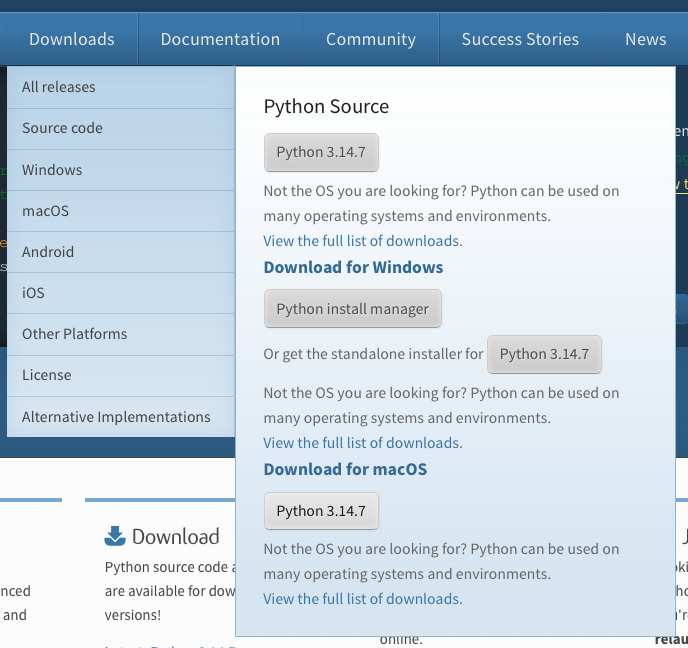

### For Windows

Download the `Python install manager` and run it. This should open a terminal window:

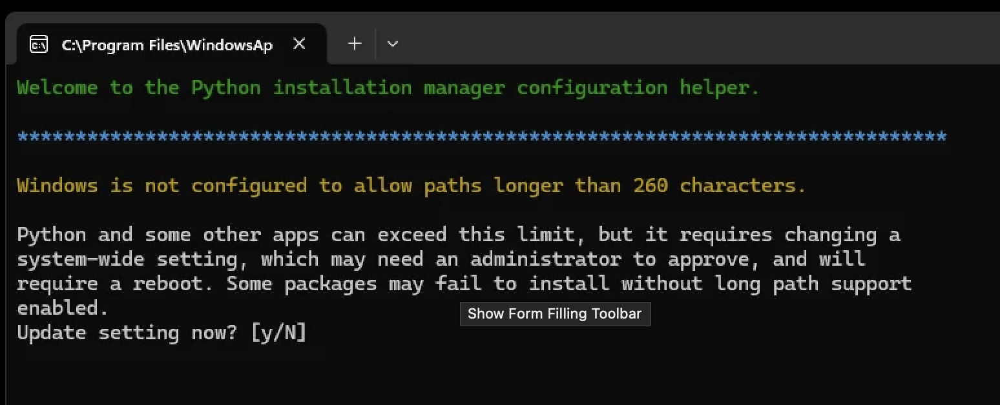

It will ask a number of questions (ending in `[y/N]`). Just input `y` and `enter` every time. to agree.

### For Mac

Simply download the python installer for Mac and run it. You don't need to select any specific options, you can just use the default installation (click `continue`, `agree` and `install` everywhere):

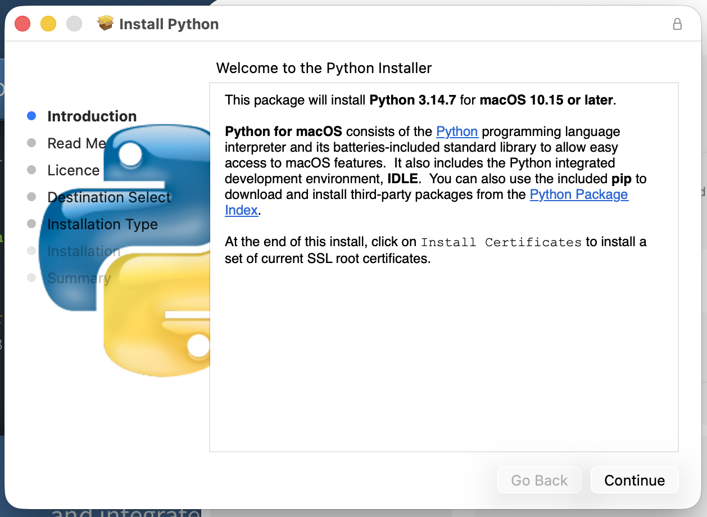


## VS Code Extensions

After launching VS Code, open the extensions tab on the left:

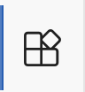

Enter Python in the search box and install the Python extensions (from Microsoft):

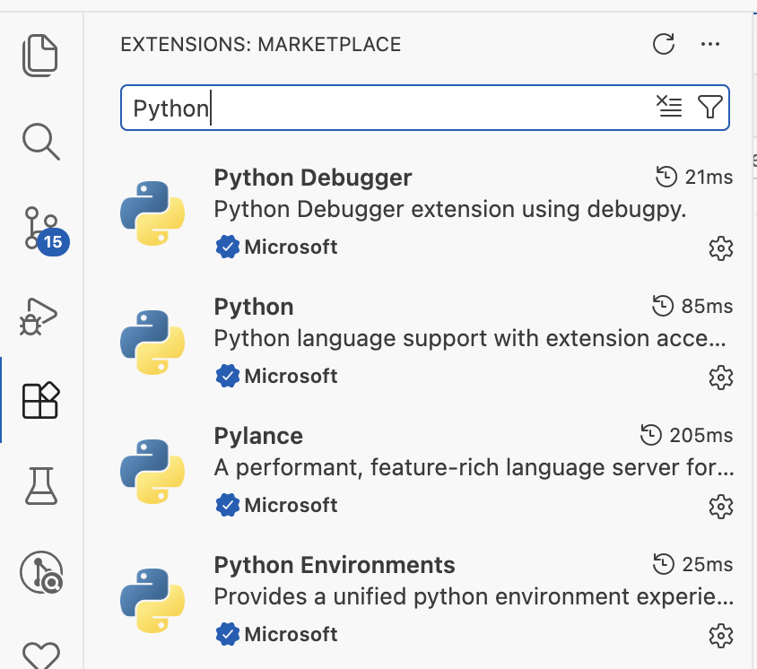

Also install the **jupyter** extensions (we'll see later what those are):

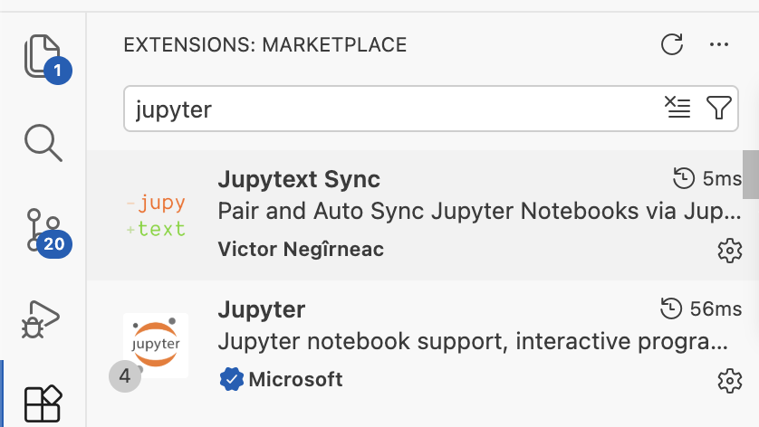

(Only install the Jupyter extension by Microsoft)

## VS Code Settings

> Important: don't skip this step! Both of these settings are **absolutely needed** to be able to use the course material properly.

We need to modify 2 VS Code settings.

You can change a setting by clicking `File > Preferences > Settings` (or `Code > Preferences > Settings` on Mac). In the text box that says `Search settings (↑↓ for history)`, you can type the name of the specific setting to modify.

### Window: Open Folders In New Window

The first setting you should modify is the setting `Window: Open Folders In New Window` (type the name in the search box). It should be set to **on**:

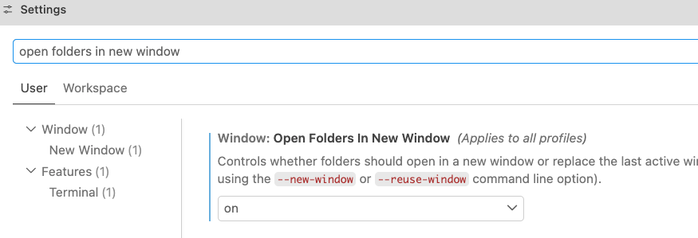

> This makes sure that when you open a new folder (for example your course folder for **Front-end Development**), it opens a new window in VS Code instead of closing the current one.

### Python-envs › Terminal: Auto Activation Type

The second setting to change is the setting `Python-envs › Terminal: Auto Activation Type`. It should be set to **shellStartup**:

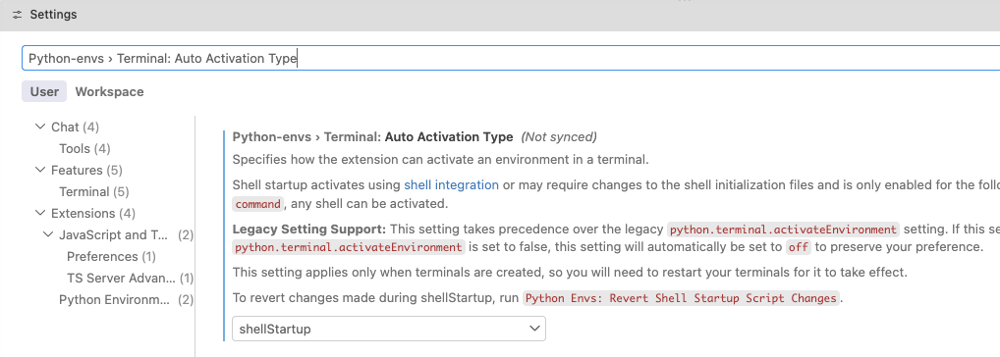


## Download the Course Material

Download the course material by going to [github-page](https://github.com/UCLL-Programming1/p1-coursematerial-2627)
(click this link) this course and under the `Code` menu click `Download ZIP`:

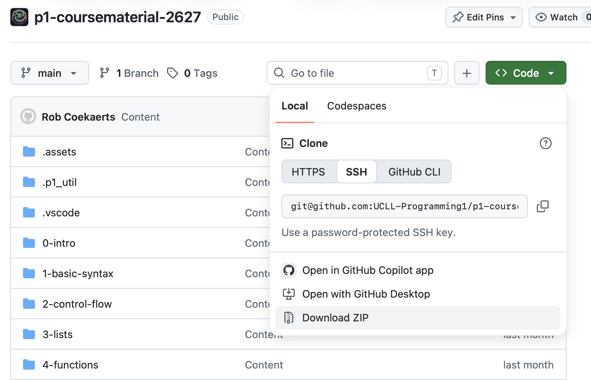

Unpack this zip-folder (unpacking is done automatically on if you use a Mac) to any folder where you want to store your course material (It's probably convenient to have a
single folder for all your current courses)


## Open Course Material in VS Code

Once you've downloaded the coursematerial, we can open it in VS Code.

To do this, select `File > Open Folder`:

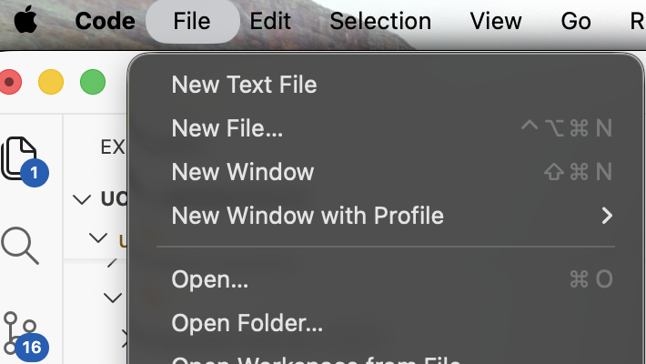

and select the course material folder you cloned in the previous step.

Now the left-hand side of your VS Code should look something like this:

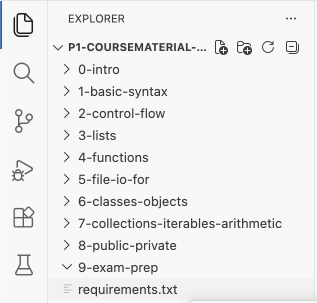

> Important: If your VS Code doesn't look like this at this point, ask your lecturer for help!

## Install Python Dependencies

Finally, we need to install some Python packages. To make this easier we've listed all of these packages in the file `requirements.txt`

In VS Code, open a new terminal by selecting `Terminal > New Terminal`:

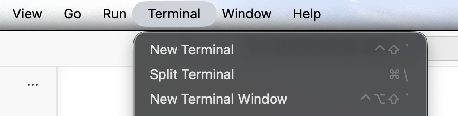

This should open a window on the bottom of VS Code:

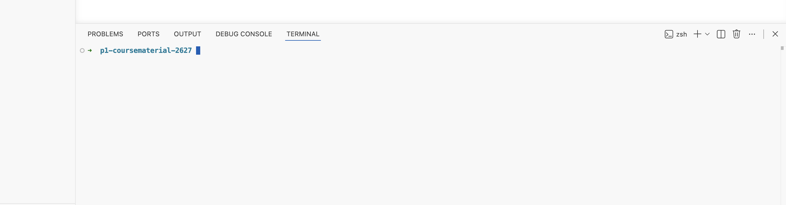

(make sure it says `p1-coursematerial-2627` - possibly starting with your directory prefix and ending with `-main`)

On **Windows**, first copy/paste the command:
```none
Set-ExecutionPolicy -Scope CurrentUser RemoteSigned
```
(If this command results in an error, reach out to your lecturer)

Then copy/paste the following command:
```none
python3 -m venv .venv
```

If this ran successfully, first **close the terminal** by clicking the trashcan icon (`Kill Terminal`):

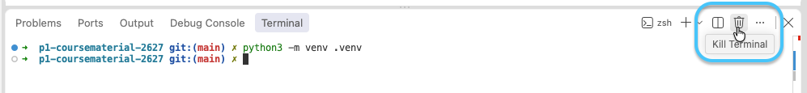

Then, open a new terminal. The prompt on the terminal should now start with `(.venv)`:

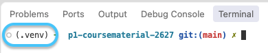

> Note: if this `(.venv)` does not appear at the start of your terminal, quit and restart VS Code.

Then copy/paste the following command to the terminal:

```none
python3 -m pip install -r requirements.txt
```

You can check whether all of this completed successfully by running the command:
```none
python3 checkinstall.py
```
(Depending on your operating system and installation process, the `python` command may also work for you in addition to the `python3` command. We use `python3` in our instructions because it should be available to everyone).

which - if everything works as intended - should give you the output:
```none
==============================================================
 Programming 1 - checking your installation
==============================================================

 [✓] Python is installed
 [✓] The Python packages from requirements.txt are installed
 [✓] p1_util is installed

--------------------------------------------------------------
 Everything checks off. You are ready to start. Nice work!
--------------------------------------------------------------
```

If you experience any problem with this installation, ask your lecturer for help. This is not the part we want you to
struggle on, we just need to do this to be able to start using Python!

In addition, we have tried to create a VS Code setup that is as intuitive to use as possible. However this is dependent
on some specific settings and using it in a specific way. If you notice that your VS Code setup looks different than
that of your lecturer or that of your fellow students, don't hesitate to ask about it, we are here to help!
