## How to use the course material

In this chapter we'll cover briefly how to use the course material.

As you can see when opening the course material in VS Code, the course material follows a folder structure:

Each of these folders corresponds to **1 week** of the course. You can click on any of them (eg **basic-syntax**), which will then expand this directory:

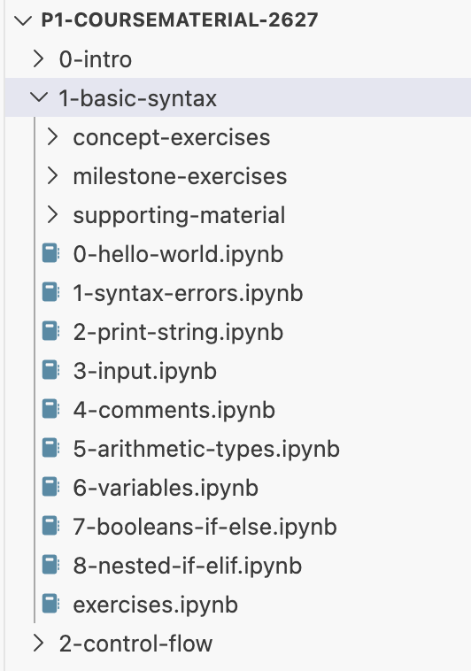

In this folder, there are:
- 3 directories (**concept-exercises**, **milestone-exercises** and **supporting-material**), we'll skip these for now.
- A bunch of files that start with a number and end in `.ipynb`: These are the files that contain all the theory of the course, together with some **smaller exercises** (that we call **concept exercises**, because they are there to practice very specific concepts of programming).
- A file `exercises.ipynb`: This file contains some **larger exercises** (that we call **milestone exercises**) that you can make at the end of every week. They integrate all the of the programming concept learned up until that point.

### Theory notebooks
Let's take a look at one of these `.ipynb` theory files. Click on one (eg `0-hello-world.ipynb`) and you'll see the following:

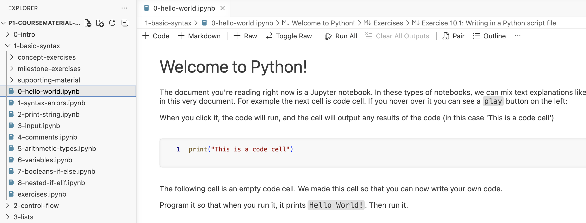

The most important property of this file is explained within it, namely that it is a file that mixes **text explanations** and **runnable code cells**.

When you **hover over a code cell**, a little **play**-button appears, which you can then click to execute the cell:

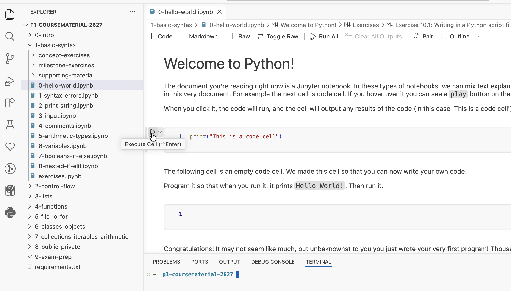

When you click it, the output of the code cell is shown under it:

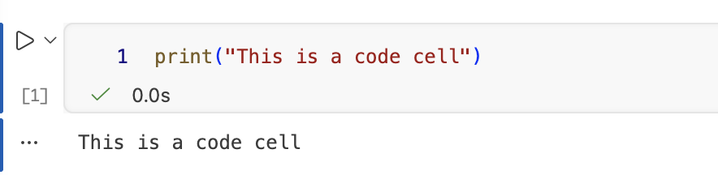

> Note: the first time you execute a cell, a prompt might show up to ask you which python environment you want to use
>
> 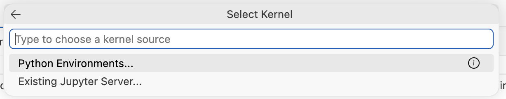

> Simply select 'Python Environments' and then the Python version that you just installed. If You have many, you might see a whole list:
>
>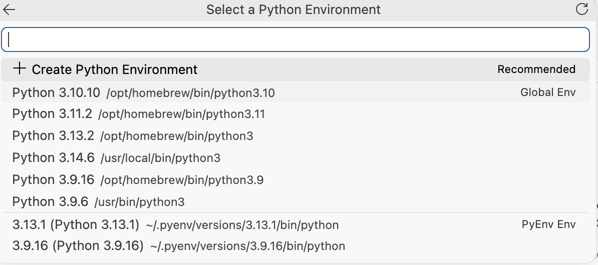

You can read the explanations in these notebooks and run the code cells to see what they do.

### Concept Exercises

At the end of these theory notebooks, you will encounter some small exercises:

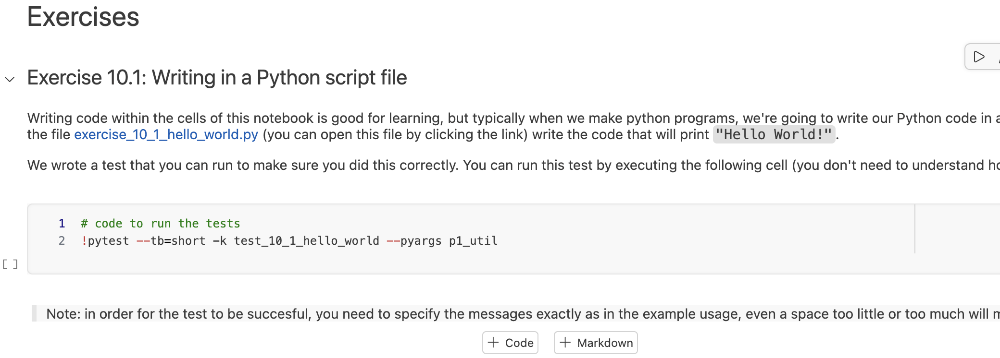

These are programming exercises. To complete them, you have to click on the linked Python file and write the necessary code to solve the exercise.

#### Testing your code
To test your code, you should always **first run the Python scripts** you wrote **yourself**, to make sure they do what you wanted them to do.

Then, **when you think they are correct**, you can run the test cells we provided:

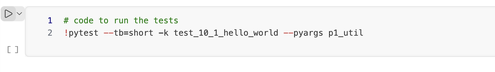

Running these cells will tell you whether the code is correct:

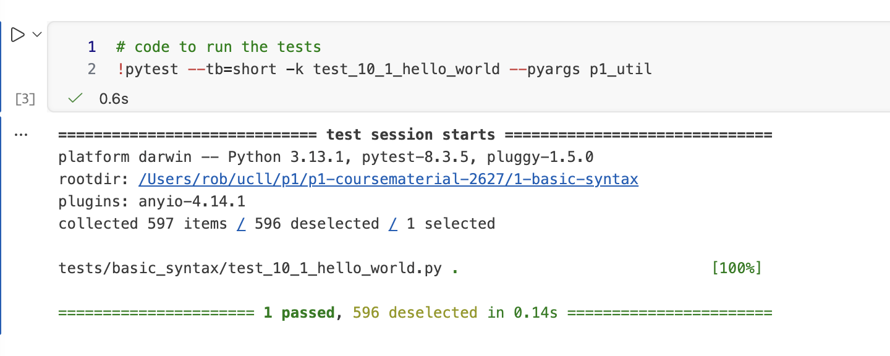

or whether there is still a mistake in it:

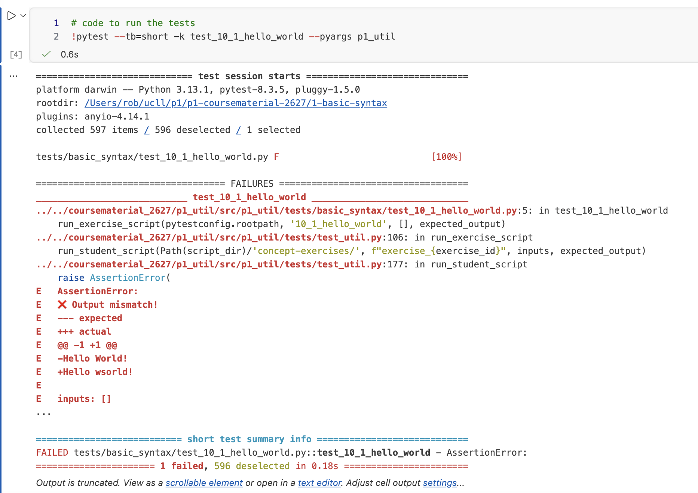

How you can decode these error messages, we will cover at a later time.

### Milestone Exercises

In addition to the 'concept exercises' at the end of every section, there are what we call 'milestone exercises' at the
end of every chapter. They are all grouped together in a single notebook `exercises.ipynb` at the end of the chapter.

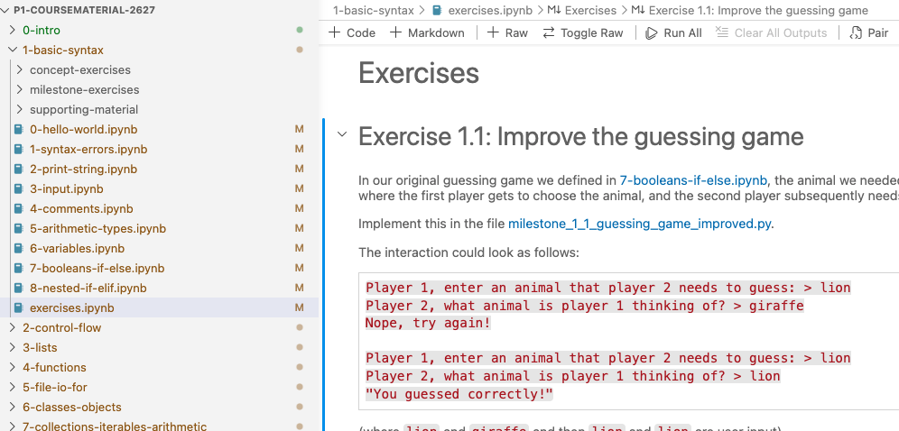

These are larger exercises, where you will write more interesting programs. To do so, you will need to master the
concepts of the previous weeks as well.

Apart from that, they work the same way as concept exercises. You write the solution to the exercise in the linked
Python file. Just like with concept exercises you can test your program by running to see if it's doing what you intended.
Finally, when you're convinced the program works as expected, you can run the test we wrote to verify.

### Concept and milestone exercise folder
All of your concept and milestone code files are grouped in a single folder per week (one for concept exercises and one
for milestone exercises):

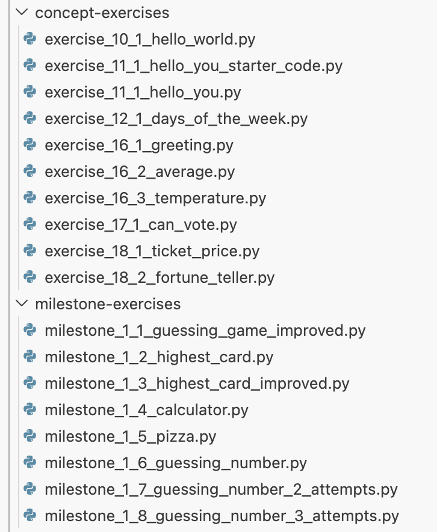

### Supporting material
The folder `supporting-material` simply contains files that the theory might sometimes refer to.

For example in chapter one, it contains a couple of code files:

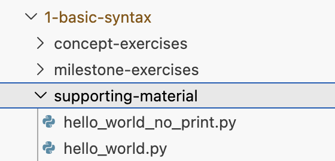

### Tips and Tricks

#### Collapsing/Expanding Notebook Sections

Sometimes when going through the jupyter notebooks, it might get a little tedious to scroll up and down these documents. It can sometimes be convenient to 'hide' certain parts of the notebook you're no longer interested in, for example, in the notebook `0-hello-world.ipynb`, we have this section:

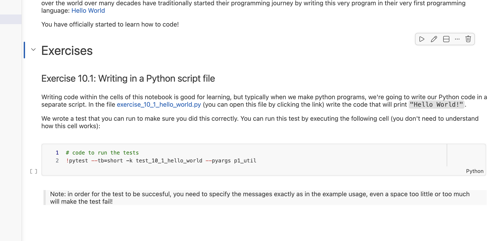

You can click on the little downward arrow next to any title (in this case 'Exercises'), to hide it:

